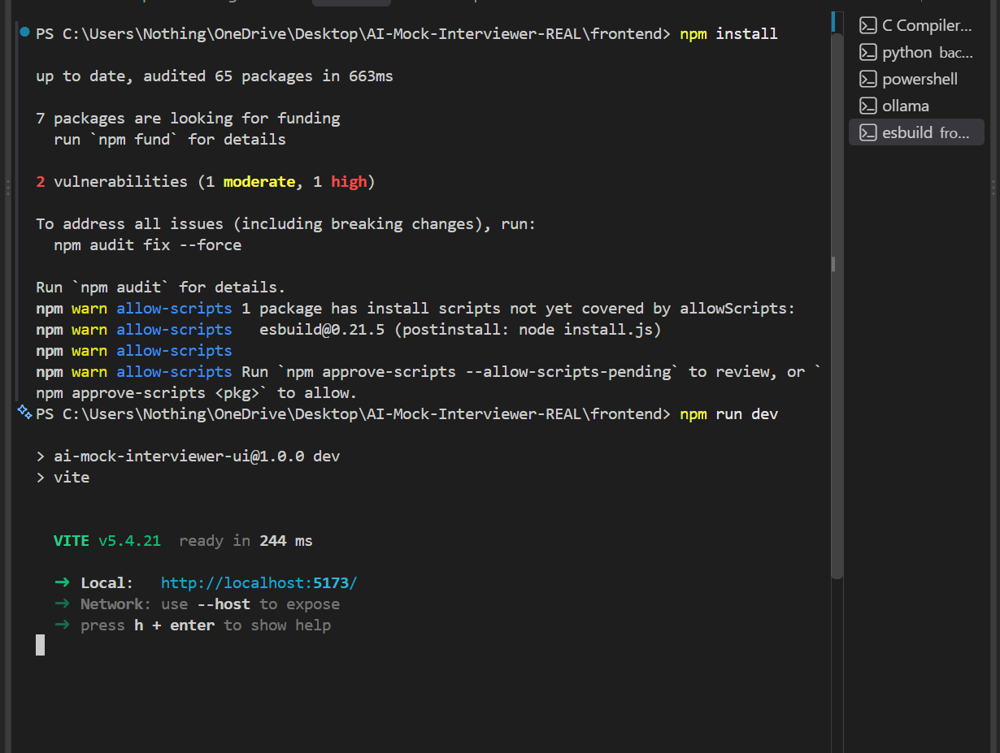
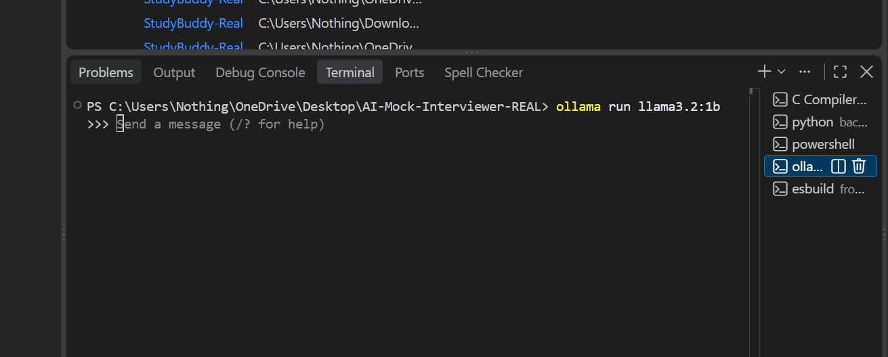
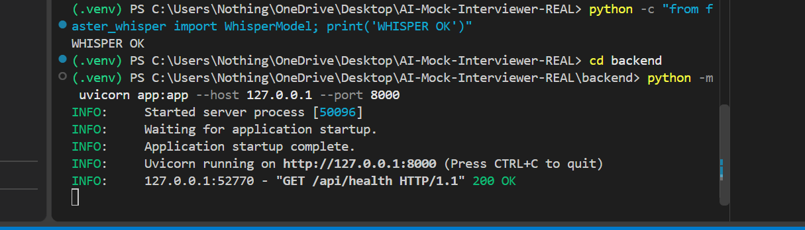
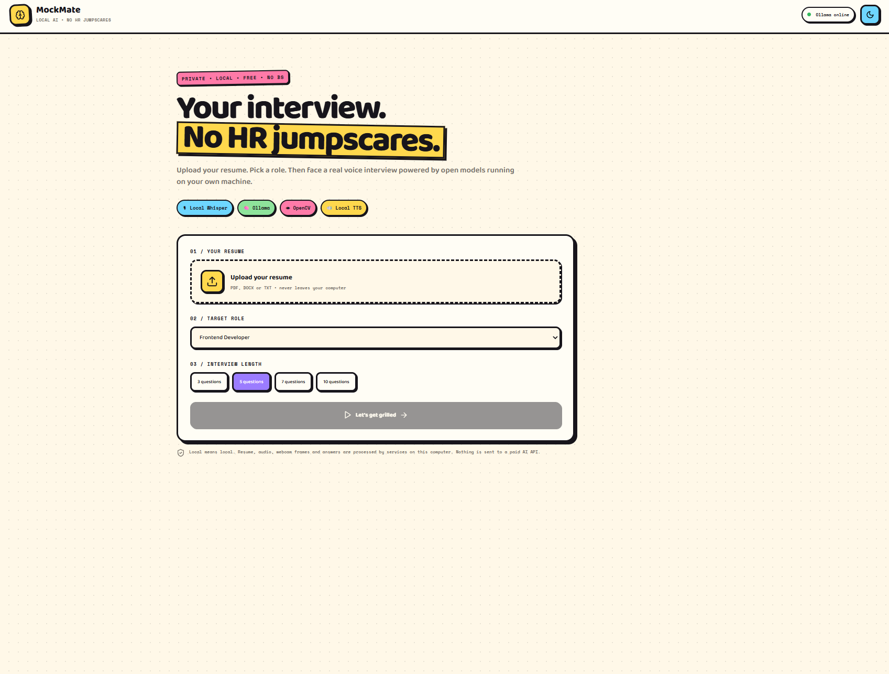

# 🤖 MockMate — AI Mock Interviewer

> **Built by [@harshitethic](https://github.com/harshitethic) for his college bhais ❤️**

A real, browser-based AI mock interview platform built for students who want to practice interviews without paying for expensive AI APIs.

**No OpenAI. No Gemini. No ElevenLabs. No paid API keys.**

Everything important runs locally on your machine using open-source/local tools.

---

## 🎯 What does it do?

MockMate turns your resume into an actual mock interview.

### The flow

```text
Upload Resume
     ↓
Choose Job Role
     ↓
Local AI generates questions
     ↓
AI interviewer asks the question
     ↓
You speak through your microphone
     ↓
Whisper transcribes your answer
     ↓
Local AI evaluates your answer
     ↓
Camera + integrity signals are tracked
     ↓
You get your interview score
```

---

## ✨ Features

### 📄 Resume-based interview

Upload:

- PDF
- DOCX
- TXT

The resume is parsed locally and used to create questions relevant to the candidate.

### 🧠 Local AI interviewer

Uses **Ollama + Llama 3.2**.

The project can run with:

```text
llama3.2:1b
```

which is lightweight enough for many student laptops.

Questions can include:

- Technical
- Resume-specific
- Projects
- Behavioral
- Role-specific

### 🎙️ Real voice answers

This isn't a fake text box.

The browser actually records your microphone.

The audio is sent to the local Python backend and transcribed using:

**faster-whisper**

No cloud transcription API is required.

### 🔊 AI interviewer voice

The interviewer can speak questions using:

**pyttsx3**

which uses local system text-to-speech.

### 📷 Webcam

The interview uses your actual webcam.

OpenCV periodically checks the camera frames.

It can detect:

- No face
- One face
- Multiple faces

### 🕵️ Integrity monitoring

MockMate tracks observable integrity signals such as:

- Tab switching
- Copy attempts
- No-face detections
- Multiple-face detections
- Camera interruptions

> ⚠️ These are **integrity signals, not proof of cheating**. A real system cannot honestly claim that a webcam detected "cheating" with certainty.

### 📊 AI evaluation

Each answer receives scores for:

- Overall
- Technical
- Communication
- Relevance
- Structure

It also gives:

- Strengths
- Improvements
- Verdict
- Follow-up feedback

---

# 🖼️ Screenshots

## Home / Setup



## Live Interview



## Answer Evaluation



## Final Results



---

# 🛠️ Tech Stack

| Part | Technology |
|---|---|
| Frontend | React + Vite |
| Backend | FastAPI |
| Local LLM | Ollama |
| Model | Llama 3.2 |
| Speech-to-text | faster-whisper |
| Text-to-speech | pyttsx3 |
| Computer vision | OpenCV |
| Resume PDF parsing | PyMuPDF |
| DOCX parsing | python-docx |
| Data | Local files |
| Styling | Custom CSS |

---

# 🔒 Privacy

This project was specifically designed to avoid paid cloud AI APIs.

Your:

- Resume
- Interview audio
- Webcam frames
- Transcripts
- Answers

are processed locally by the application.

There is no requirement for:

```text
OPENAI_API_KEY
GEMINI_API_KEY
ELEVENLABS_API_KEY
```

or any other paid AI key.

---

# 💻 Requirements

Recommended:

- Windows / macOS / Linux
- Python 3.12
- Node.js 18+
- 8 GB RAM+
- Webcam
- Microphone
- Ollama
- GPU is helpful but not mandatory

### Why Python 3.12?

The local Whisper dependency stack is considerably easier to run reliably on Python 3.12 than the newest Python releases.

---

# 🚀 Installation

## 1. Clone the repository

```bash
git clone https://github.com/harshitethic/AI-Mock-Interviewer.git
cd AI-Mock-Interviewer
```

---

## 2. Install Ollama

Install Ollama and then download the lightweight model:

```bash
ollama pull llama3.2:1b
```

Test it:

```bash
ollama run llama3.2:1b
```

Try:

```text
Say hello in one sentence.
```

If it answers, Ollama is ready.

---

# 🐍 Backend setup

Create a Python 3.12 virtual environment.

### Windows

```powershell
py -3.12 -m venv .venv
```

Activate:

```powershell
.venv\Scripts\Activate.ps1
```

Verify:

```powershell
python --version
```

It should say:

```text
Python 3.12.x
```

Install dependencies:

```powershell
python -m pip install --upgrade pip
pip install -r backend\requirements.txt
```

Test Whisper:

```powershell
python -c "from faster_whisper import WhisperModel; print('WHISPER OK')"
```

Start the backend:

```powershell
cd backend
python -m uvicorn app:app --host 127.0.0.1 --port 8000
```

You should see:

```text
Uvicorn running on http://127.0.0.1:8000
```

**Keep this terminal open.**

---

# 🌐 Frontend setup

Open another terminal.

```powershell
cd frontend
npm install
npm run dev
```

Open:

```text
http://localhost:5173
```

---

# 🧩 Three-terminal setup

The easiest way to run the complete project is:

### Terminal 1 — Ollama

```powershell
ollama run llama3.2:1b
```

### Terminal 2 — Backend

```powershell
.venv\Scripts\Activate.ps1
cd backend
python -m uvicorn app:app --host 127.0.0.1 --port 8000
```

### Terminal 3 — Frontend

```powershell
cd frontend
npm run dev
```

Then open:

```text
http://localhost:5173
```

---

# 🧪 Test the backend

You can check whether the local services are connected:

```powershell
curl.exe http://127.0.0.1:8000/api/health
```

A healthy response should contain:

```json
{
  "ok": true,
  "ollama": true,
  "models": [
    "llama3.2:1b"
  ]
}
```

---

# 📁 Project structure

```text
AI-Mock-Interviewer/
│
├── backend/
│   ├── app.py
│   ├── requirements.txt
│   │
│   └── services/
│       ├── llm.py
│       ├── resume.py
│       ├── speech.py
│       └── vision.py
│
├── frontend/
│   ├── package.json
│   ├── vite.config.js
│   ├── index.html
│   │
│   └── src/
│       ├── main.jsx
│       └── styles.css
│
├── screenshots/
│   ├── home.png
│   ├── interview.png
│   ├── evaluation.png
│   └── results.png
│
└── README.md
```

---

# 🧠 How the AI pipeline works

## Question generation

```text
Resume
  ↓
Python resume parser
  ↓
Relevant resume context
  ↓
Ollama
  ↓
Llama 3.2
  ↓
Interview questions
```

## Answer evaluation

```text
Microphone
  ↓
Browser MediaRecorder
  ↓
Local FastAPI server
  ↓
faster-whisper
  ↓
Transcript
  ↓
Ollama
  ↓
Score + feedback
```

## Integrity monitoring

```text
Webcam
  ↓
Browser frame
  ↓
FastAPI
  ↓
OpenCV
  ↓
Face count
  ↓
Integrity signal
```

---

# ⚠️ Limitations

This is a serious working student project, but it is not pretending to be a commercial interview-proctoring system.

### Local AI performance depends on your hardware

A small model such as:

```text
llama3.2:1b
```

is faster and easier to run locally, but it won't evaluate answers as deeply as a much larger model.

### Cheating detection isn't perfect

The system detects signals, not intent.

For example:

```text
2 faces ≠ confirmed cheating
```

Someone else could simply walk into the room.

Similarly:

```text
tab switch ≠ confirmed cheating
```

The student could have accidentally switched windows.

That's why the report calls them **integrity signals**.

---

# 🎓 Why I built this

College students shouldn't need to spend money on multiple AI APIs just to build a good final-year or semester project.

The goal of MockMate is simple:

> **Take this repo, run it locally, understand the code, customize it, and use it as your college project.**

You can extend it with:

- More job roles
- Better resume parsing
- More local models
- Interview history
- User accounts
- Question difficulty adaptation
- Voice emotion analysis
- Better proctoring
- PDF report generation
- Admin dashboard
- Interview analytics

---

# 👨‍💻 Built by

### @harshitethic

Built by **[@harshitethic](https://github.com/harshitethic)**

**For his college bhais ❤️**

Made for students who want a project that actually works instead of another dead demo with:

```text
"Insert API key here"
```

😤

---

# ⭐ If this helped you

Star the repository.

Fork it.

Break it.

Fix it.

Make it better.

And if you use it for your college project, **actually understand the code before your viva**. 😭

---

## License

MIT License — use it, modify it, learn from it, and build on it.
